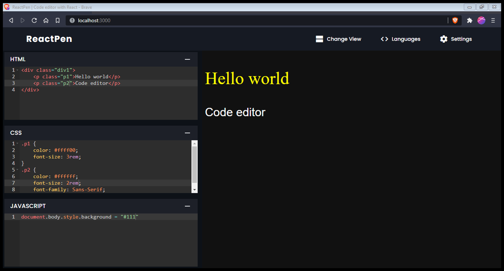
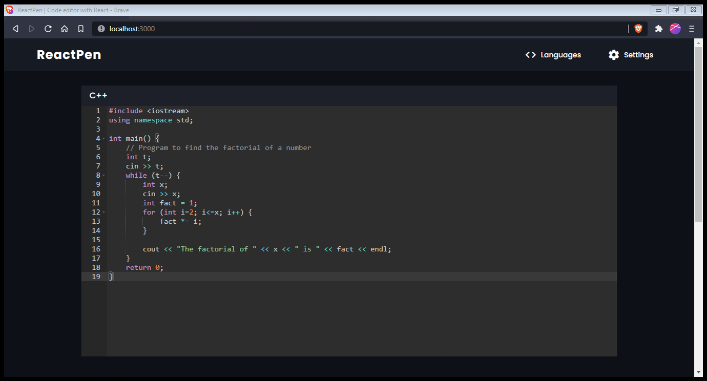
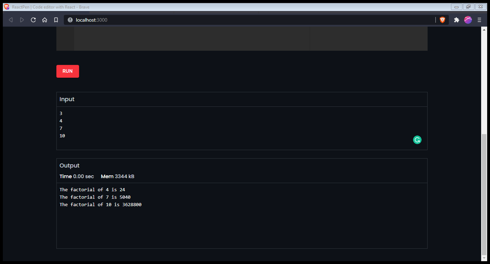

# ReactPen
A code editor app using React and TailwindCSS. In this app, the user can enter code in two different editors. One is for web development technologies which include HTML, CSS and JavaScript. Other one is for programming languages such as C, C++, Java and Python. User can enter code in any of the editors and see the output of his code.

This app uses React on client side, TailwindCSS and Material-UI for styling, and NodeJS and Express on server side.

This app was developed as a project given in SMP 2021 by EEESoc. Deployed app can be viewed in the link below

[Demo here](https://next-pen.vercel.app/)

## Commands 

```bash
# Install dependencies (server & client)
npm install
cd client && npm install

# Run server & client (:3000 & :5000)
npm run dev
```


## Usage

#### WebD Editor

User can enter code in HTML, CSS and(or) JavaScript and see the output for his code




#### Programming language Editor

User can enter code in any of the languages provided which are C, C++, Java and Python.



After clicking the run button, the code is compiled by the JDoodle API and the output is displayed.


